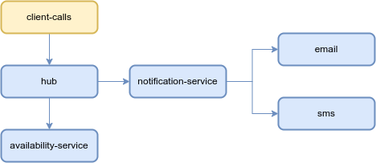

# Observability Workshop with Grafana Cloud

- [Observability Workshop with Grafana Cloud](#observability-workshop-with-grafana-cloud)
  - [Prerequisites](#prerequisites)
  - [LAB 01 : Deploy the Agent Grafana Alloy \& Use Kubernetes Observability](#lab-01--deploy-the-agent-grafana-alloy--use-kubernetes-observability)
  - [LAB 02 : Deploy Microservices \& send](#lab-02--deploy-microservices--send)
  - [LAB 03 : Finding root cause with Grafana Cloud](#lab-03--finding-root-cause-with-grafana-cloud)


## Prerequisites

Make sure you have your credentials to access webtty & grafana cloud stack

- Grafana Cloud Stack : https://USERID.grafana.net

- WebTTY ssh console : https://WORKSHOPID.work-shop.grafana.net


## LAB 01 : Deploy the Agent Grafana Alloy & Use Kubernetes Observability

1. Open a terminal to the environement in a browser to ```https://WORKSHOPID.work-shop.grafana.net``` with the received credentials
2. Open Grafana in a browser ```https://USERID.work-shop.grafana.net``` with the received credentials
3. Navigate to Infrastructure -> Kubernetes.


4. Click on Start Sending Data
5. Click on Install
6. Fill in cluster information
Cluster name : WORKSHOPID-USERID
Namespace : agents
Tick option : Grafana Application Observability


7. Name the token ```k8stelemetry``` Cick on create new token


8. Copy Helm command and run in webtty


## LAB 02 : Deploy Microservices & send

Architecture of microservices apps

)

In the web tty

```sh
kubectl create ns apps

kubectl -n apps apply -f https://raw.githubusercontent.com/grafana/k8s-appo11y-workshop/refs/heads/master/microservices/room-availability/deploy-success.yaml

kubectl -n apps apply -f https://raw.githubusercontent.com/grafana/k8s-appo11y-workshop/refs/heads/master/microservices/email-channel/deploy.yaml

kubectl -n apps apply -f https://raw.githubusercontent.com/grafana/k8s-appo11y-workshop/refs/heads/master/microservices/sms-channel/deploy.yaml

kubectl -n apps apply -f https://raw.githubusercontent.com/grafana/k8s-appo11y-workshop/refs/heads/master/microservices/booking-notification/deploy.yaml

kubectl -n apps apply -f https://raw.githubusercontent.com/grafana/k8s-appo11y-workshop/refs/heads/master/microservices/booking-hub/deploy.yaml

kubectl -n apps apply -f https://raw.githubusercontent.com/grafana/k8s-appo11y-workshop/refs/heads/master/k6/k6.yaml

```

deploy faulty component 
```sh 
kubectl -n apps apply -f https://raw.githubusercontent.com/grafana/k8s-appo11y-workshop/refs/heads/master/microservices/room-availability/deploy-faulty.yaml

```

## LAB 03 : Finding root cause with Grafana Cloud