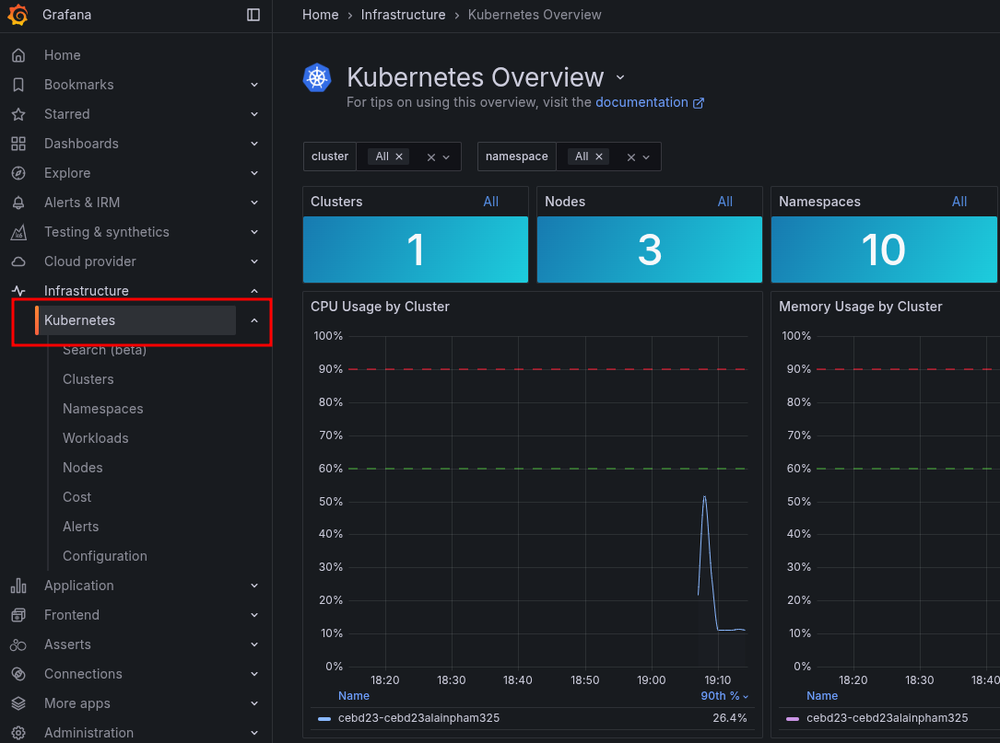

# Observability Workshop with Grafana Cloud

- [Observability Workshop with Grafana Cloud](#observability-workshop-with-grafana-cloud)
  - [Prerequisites](#prerequisites)
  - [LAB 01 : Deploy the Agent Grafana Alloy \& Use Kubernetes Observability](#lab-01--deploy-the-agent-grafana-alloy--use-kubernetes-observability)
  - [LAB 02 : Deploy Microservices \& send data](#lab-02--deploy-microservices--send-data)
  - [LAB 03 : Finding root cause with Grafana Cloud](#lab-03--finding-root-cause-with-grafana-cloud)
- [Appendix](#appendix)


## Prerequisites

Make sure you have your credentials to access webtty & grafana cloud stack

- Grafana Cloud Stack : https://USERID.grafana.net

- WebTTY ssh console : https://WORKSHOPID.work-shop.grafana.net


## LAB 01 : Deploy the Agent Grafana Alloy & Use Kubernetes Observability

1. Open a terminal to the environement in a browser to ```https://WORKSHOPID.work-shop.grafana.net``` with the received credentials
2. Open Grafana in a browser ```https://USERID.work-shop.grafana.net``` with the received credentials

3. In Grafana Cloud UI, Activate application observability


4. Navigate to Infrastructure -> Kubernetes.


5. Click on Start Sending Data
6. Click on Install
7. Fill in cluster information

to get cluster name in webtty
kubectl config view --minify -o jsonpath='{.clusters[0].name}' && echo

Cluster name : WORKSHOPID-USERID
Namespace : agents
Tick option : Grafana Application Observability


1. Name the token ```k8stelemetry``` Cick on create new token


8. Copy Helm command and run in webtty


9. Check if agent pods are running in webtty

```sh
kubectl get pods -n agents
```

expected results

```
$ kubectl get pods -n agents

NAME                                                         READY   STATUS    RESTARTS   AGE
grafana-k8s-monitoring-alloy-0                               2/2     Running   0          5m32s
grafana-k8s-monitoring-alloy-events-86cd889b7-wckgv          2/2     Running   0          5m32s
grafana-k8s-monitoring-alloy-logs-257qr                      2/2     Running   0          5m33s
grafana-k8s-monitoring-alloy-logs-7d5w8                      2/2     Running   0          5m33s
grafana-k8s-monitoring-alloy-logs-f7szw                      2/2     Running   0          5m33s
grafana-k8s-monitoring-kepler-mb92c                          1/1     Running   0          5m31s
grafana-k8s-monitoring-kepler-tgjgp                          1/1     Running   0          5m30s
grafana-k8s-monitoring-kepler-x9nvx                          1/1     Running   0          5m30s
grafana-k8s-monitoring-kube-state-metrics-5d9bd787cc-56kjc   1/1     Running   0          5m32s
grafana-k8s-monitoring-opencost-7645f5d9d-hhpd9              1/1     Running   0          5m32s
grafana-k8s-monitoring-prometheus-node-exporter-llsbc        1/1     Running   0          5m33s
grafana-k8s-monitoring-prometheus-node-exporter-qg27t        1/1     Running   0          5m33s
grafana-k8s-monitoring-prometheus-node-exporter-w84vm        1/1     Running   0          5m33s
```

10. check Kubernetes Monitoring App




## LAB 02 : Deploy Microservices & send data

Architecture of microservices apps

)

1. In the web tty, deploy all services

```sh
kubectl create ns apps

kubectl -n apps apply -f https://raw.githubusercontent.com/grafana/k8s-appo11y-workshop/refs/heads/master/microservices/room-availability/deploy-faulty.yaml

kubectl -n apps apply -f https://raw.githubusercontent.com/grafana/k8s-appo11y-workshop/refs/heads/master/microservices/email-channel/deploy.yaml

kubectl -n apps apply -f https://raw.githubusercontent.com/grafana/k8s-appo11y-workshop/refs/heads/master/microservices/sms-channel/deploy.yaml

kubectl -n apps apply -f https://raw.githubusercontent.com/grafana/k8s-appo11y-workshop/refs/heads/master/microservices/booking-notification/deploy.yaml

kubectl -n apps apply -f https://raw.githubusercontent.com/grafana/k8s-appo11y-workshop/refs/heads/master/microservices/booking-hub/deploy.yaml

kubectl -n apps apply -f https://raw.githubusercontent.com/grafana/k8s-appo11y-workshop/refs/heads/master/k6/k6.yaml

```

2. Explore Application Observability


## LAB 03 : Finding root cause with Grafana Cloud

# Appendix

deploy non buggy component 
```sh 
kubectl -n apps apply -f https://raw.githubusercontent.com/grafana/k8s-appo11y-workshop/refs/heads/master/microservices/room-availability/deploy-success.yaml

```

