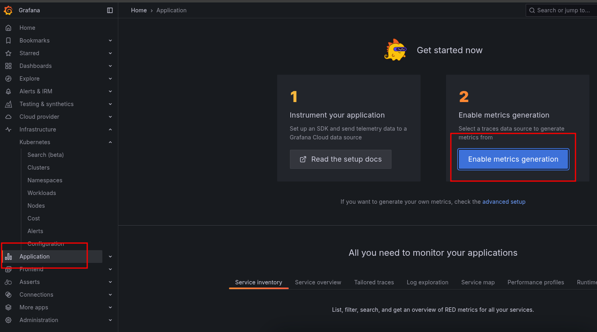
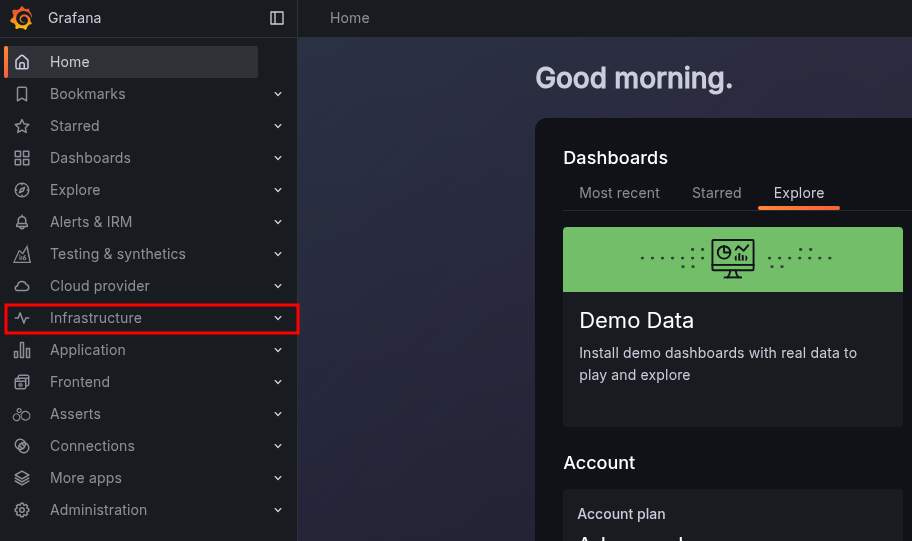
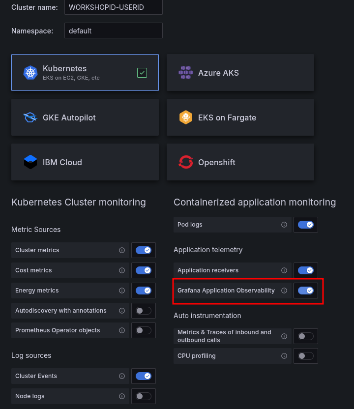
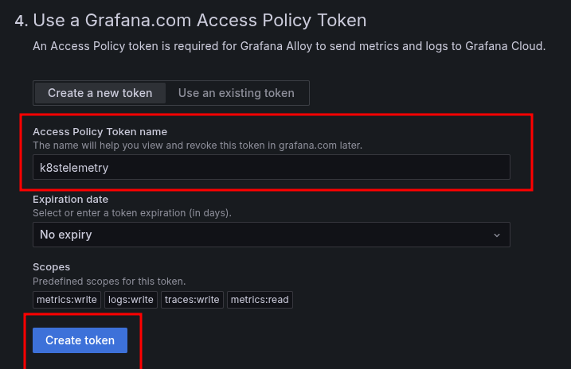
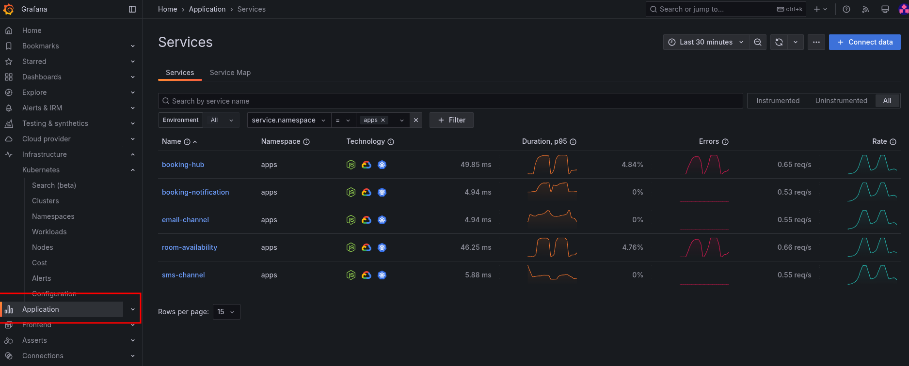
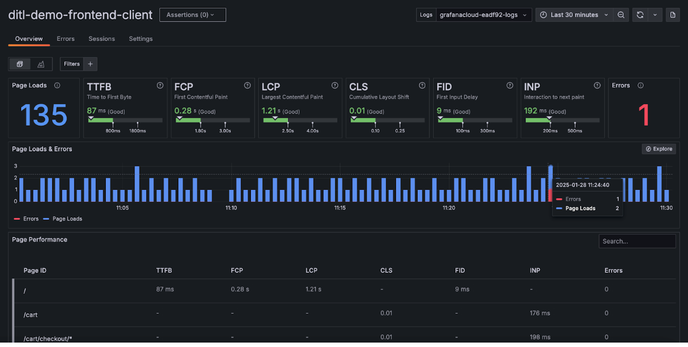
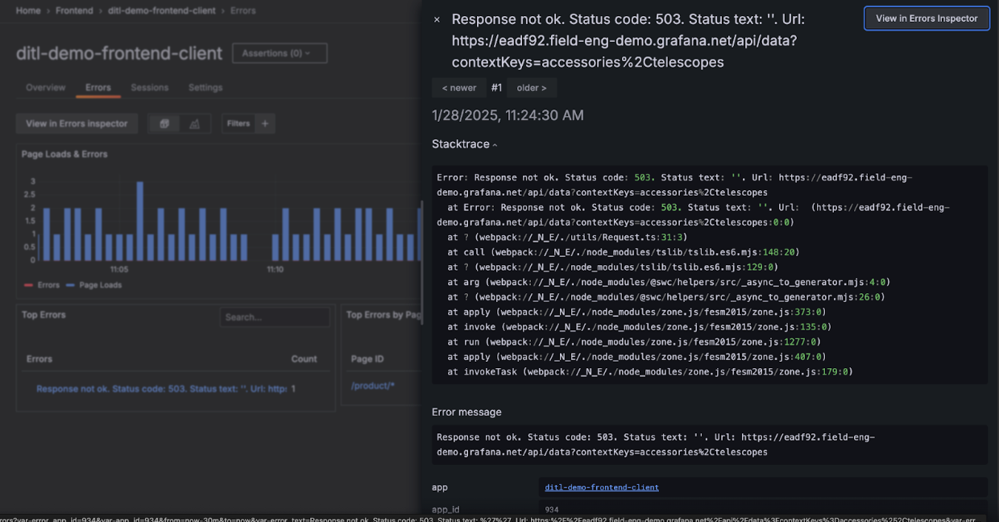
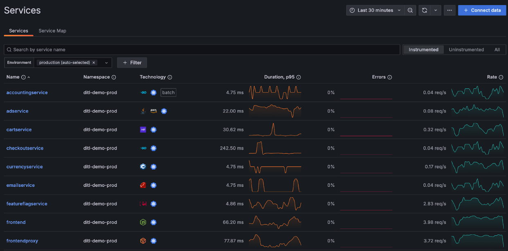
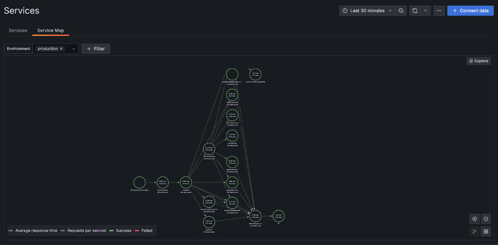
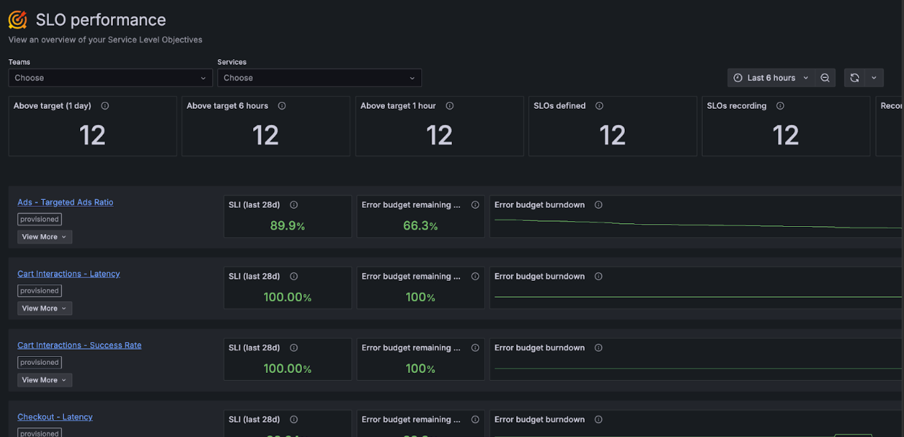

# Observability Workshop with Grafana Cloud

- [Observability Workshop with Grafana Cloud](#observability-workshop-with-grafana-cloud)
  - [Prerequisites](#prerequisites)
  - [LAB 01 : Deploy the Agent Grafana Alloy \& Use Kubernetes Observability](#lab-01--deploy-the-agent-grafana-alloy--use-kubernetes-observability)
  - [LAB 02 : Deploy Microservices \& send data](#lab-02--deploy-microservices--send-data)
  - [LAB 03 : Troubleshooting issues with Grafana Cloud O11y solutions](#lab-03--troubleshooting-issues-with-grafana-cloud-o11y-solutions)
    - [LAB 3.1 : Explore the healthy instance](#lab-31--explore-the-healthy-instance)
- [Appendix](#appendix)


## Prerequisites

Make sure you have your credentials to access webtty & grafana cloud stack

- Grafana Cloud Stack : https://USERID.grafana.net

- WebTTY ssh console : https://WORKSHOPID.work-shop.grafana.net


## LAB 01 : Deploy the Agent Grafana Alloy & Use Kubernetes Observability

1. Open a terminal to the environement in a browser to ```https://WORKSHOPID.work-shop.grafana.net``` with the received credentials
2. Open Grafana in a browser ```https://USERID.work-shop.grafana.net``` with the received credentials

3. In Grafana Cloud UI, Activate application observability



4. Navigate to Infrastructure -> Kubernetes.



5. Click on Start Sending Data
6. Click on Install
7. Fill in cluster information

To get cluster name in webtty

```
kubectl config view --minify -o jsonpath='{.clusters[0].name}' && echo
```

```
Cluster name : WORKSHOPID-USERID
Namespace : default
Tick option "Grafana Application Observability"
```



1. Name the token ```k8stelemetry``` Cick on create new token



8. Copy Helm command and run in webtty


9. Check if agent pods are running in webtty

```sh
kubectl get pods
```

expected results

```
$ kubectl get pods

NAME                                                         READY   STATUS    RESTARTS   AGE
grafana-k8s-monitoring-alloy-0                               2/2     Running   0          5m32s
grafana-k8s-monitoring-alloy-events-86cd889b7-wckgv          2/2     Running   0          5m32s
grafana-k8s-monitoring-alloy-logs-257qr                      2/2     Running   0          5m33s
grafana-k8s-monitoring-alloy-logs-7d5w8                      2/2     Running   0          5m33s
grafana-k8s-monitoring-alloy-logs-f7szw                      2/2     Running   0          5m33s
grafana-k8s-monitoring-kepler-mb92c                          1/1     Running   0          5m31s
grafana-k8s-monitoring-kepler-tgjgp                          1/1     Running   0          5m30s
grafana-k8s-monitoring-kepler-x9nvx                          1/1     Running   0          5m30s
grafana-k8s-monitoring-kube-state-metrics-5d9bd787cc-56kjc   1/1     Running   0          5m32s
grafana-k8s-monitoring-opencost-7645f5d9d-hhpd9              1/1     Running   0          5m32s
grafana-k8s-monitoring-prometheus-node-exporter-llsbc        1/1     Running   0          5m33s
grafana-k8s-monitoring-prometheus-node-exporter-qg27t        1/1     Running   0          5m33s
grafana-k8s-monitoring-prometheus-node-exporter-w84vm        1/1     Running   0          5m33s
```

10. check Kubernetes Monitoring App


## LAB 02 : Deploy Microservices & send data

Architecture of microservices apps


1. In the web tty, deploy all services

```sh
kubectl create ns apps

kubectl -n apps apply -f https://raw.githubusercontent.com/grafana/k8s-appo11y-workshop/refs/heads/master/microservices/room-availability/deploy-faulty.yaml

kubectl -n apps apply -f https://raw.githubusercontent.com/grafana/k8s-appo11y-workshop/refs/heads/master/microservices/email-channel/deploy.yaml

kubectl -n apps apply -f https://raw.githubusercontent.com/grafana/k8s-appo11y-workshop/refs/heads/master/microservices/sms-channel/deploy.yaml

kubectl -n apps apply -f https://raw.githubusercontent.com/grafana/k8s-appo11y-workshop/refs/heads/master/microservices/booking-notification/deploy.yaml

kubectl -n apps apply -f https://raw.githubusercontent.com/grafana/k8s-appo11y-workshop/refs/heads/master/microservices/booking-hub/deploy.yaml

kubectl -n apps apply -f https://raw.githubusercontent.com/grafana/k8s-appo11y-workshop/refs/heads/master/k6/k6.yaml

```

2. Explore Application Observability




## LAB 03 : Troubleshooting issues with Grafana Cloud O11y solutions

In this workshop, we will use different Grafana Cloud products to find and analyse issues with our application. We have prepared for you an online store application with different microservices, running in K8S, and already configured to send all data to Grafana Cloud. You will use three different instances:

- Grafana: https://WORKSHOPID_HEALTHY.grafana.net: is a healthy instance where there’s no problems in the application. You can use it to see how the different services behave. The web application is accessible here: https://WORKSHOPID_HEALTHY.field-eng-demo.grafana.net/ 

- Grafana: https://WORKSHOPID_ERROR.grafana.net/ : is an instance where several issues are happening. You will use FE O11y, App O11y and other services to troubleshoot what’s going on. The web application is accessible here: https://WORKSHOPID_ERROR.field-eng-demo.grafana.net/ 

- Grafana: https://WORKSHOPID_ASSERTS.grafana.net is an instance where Asserts has been configured and an incident happened in the last 24 hours. You will get a feel about how Asserts can help you in troubleshooting. The web application is accessible here: 

Your instructor provided you with your personal accounts to access each of these 3 instances.

### LAB 3.1 : Explore the healthy instance

Connect to the healthy instance and get familiarized with the environment and application. 

[https://WORKSHOPID_HEALTHY.grafana.net](https://WORKSHOPID_HEALTHY.grafana.net)


Access the website and click around. Add products to cart, checkout, see recommendations, etc. The website should work correctly, and react fast.


Go to Grafana, Frontend Observability and review the KPI. The web vitals should be generally good. The number of errors is 0 or low.  



Navigate to the error tab, and click to see the details of any errors that are happening. This should be an isolated error which can happen even if the application is healthy. We have introduced a very small number of random errors.



Go to Application O11y and get an overview of the services. See if there are any errors or slowness. Everything should be good. 



Navigate to the service Map and see how these services are connected to each other.



Now come back to services, click on one service, and check that all the data is correctly collected. See the metrics, traces and logs.

Finally, go to the SLO Performance page, and see the different KPI. Once again, everything should be green.



# Appendix

deploy non buggy component 
```sh 
kubectl -n apps apply -f https://raw.githubusercontent.com/grafana/k8s-appo11y-workshop/refs/heads/master/microservices/room-availability/deploy-success.yaml

```

